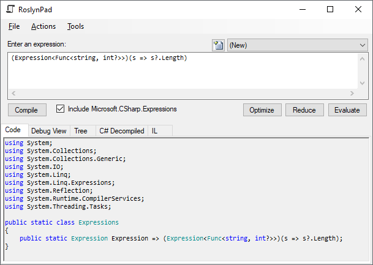
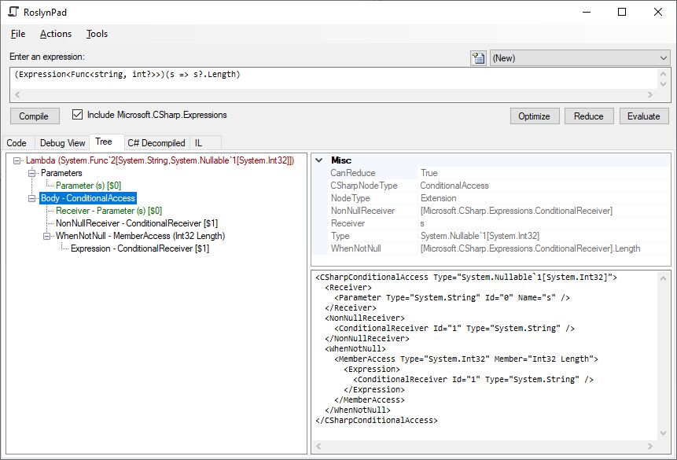
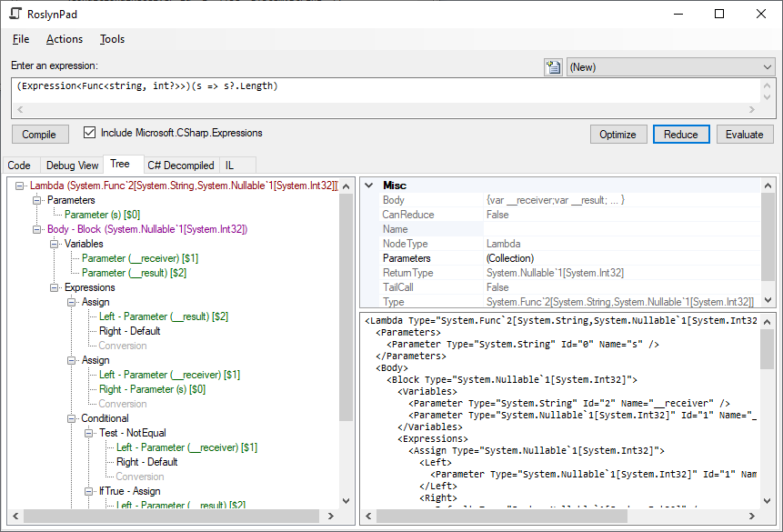
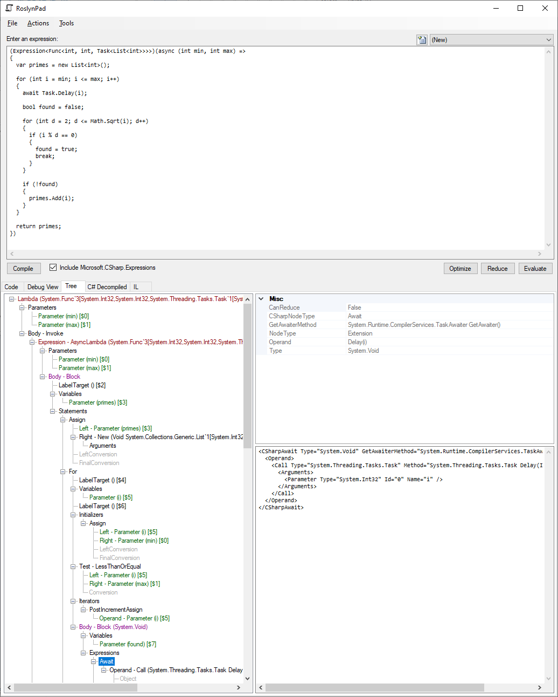
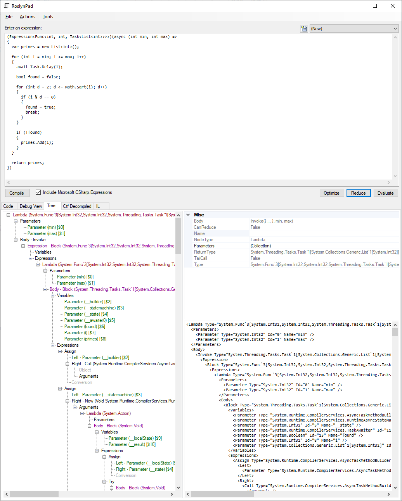
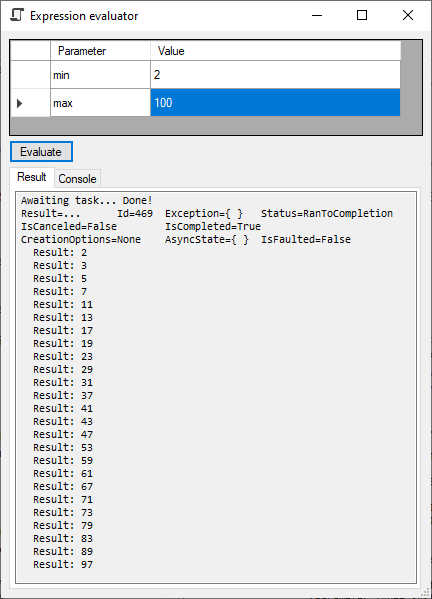
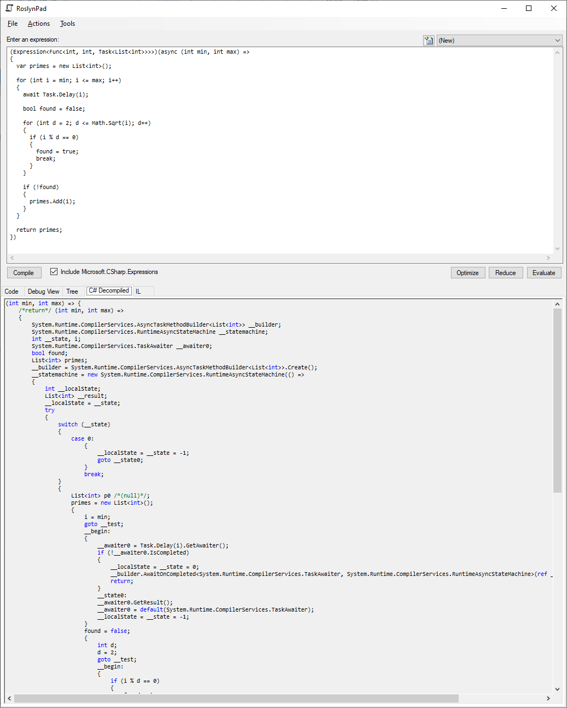
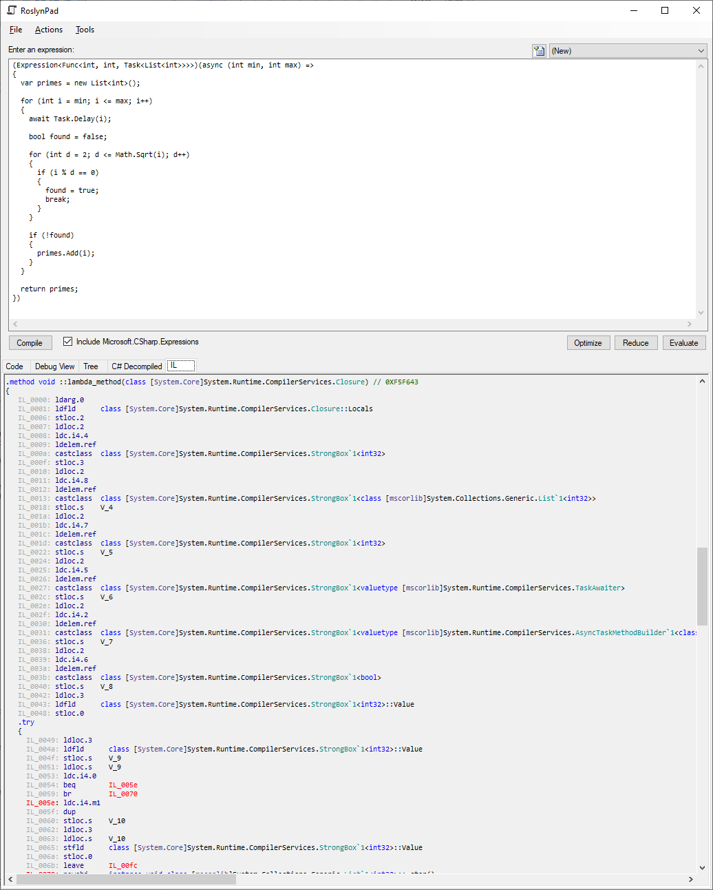

# RoslynPad Utility

RoslynPad is a utility that enables compiling C# snippets that construct expression trees. For example:

```csharp
(Expression<Func<int>>)(() => 42)
```

This tools enables inspection of the expression tree code generated by the Roslyn fork in this repo, including support for C# language constructs that are currently not supported in expression trees (i.e. C# 4.0, 5.0, and 6.0 features). An example is shown below:



In here, we use the C# 6.0 null-propagating `?.` operator, which is not supported in expression trees. By selecting `Include Microsoft.CSharp.Expressions`, support for this language construct is enabled.

Looking at the `Tree` tab, we can see the new `CSharpExpression` nodes being used to represent the `?.` expression:



Clicking on the `Reduce` button will trigger lowering of the new nodes to the original `System.Linq.Expressions` node types, thus proving that all new nodes can be built on top of the existing facilities in the .NET standard libraries:



Therefore, all new expressions can be compiled and evaluated as well, including very complex expressions using statement nodes and `async` lambdas. Consider the following example:

```csharp
(Expression<Func<int, int, Task<List<int>>>>)(async (int min, int max) =>
{
  var primes = new List<int>();

  for (int i = min; i <= max; i++)
  {
    await Task.Delay(i);

    bool found = false;

    for (int d = 2; d <= Math.Sqrt(i); d++)
    {
      if (i % d == 0)
      {
        found = true;
        break;
      }
    }

    if (!found)
    {
      primes.Add(i);
    }
  }

  return primes;
})
```

which contains a ton of constructs not supported in expression trees today, including statements (`if`, `for`, `return`, `break`), `async` lambdas, `await` expressions, etc. Compiling this "just works" (yes, also for any awaitable type, and for task-like return types):



and reduction generates the familiar async state machine that turns the async lambda into a regular lambda:



If you look carefully at the image above, you'll see familiar things such as `__state` variables, `AsyncTaskMethodBuilder` construction, etc. It goes without saying the evaluation "just works":



Finally, RoslynPad has a decompiler:



and IL visualizer:



which can be used to evaluate the efficiency of the generated code. The `Optimize` button illustrates another expression tree optimizer library (orthogonal to the Roslyn language bindings and even the `Microsoft.CSharp.Expressions` library; i.e. it works for any existing expression tree and operates on lowered forms) which could be considered for inclusion in .NET metaprogramming facilities.

TODO - further detailed descriptions of:

* Code editor for expressions
* Use of Roslyn workspace services
* Optional reference to Microsoft.CSharp.Expressions
* Reduce, optimize, and evaluate support
* Tree visualization
* C# and IL decompilers
* Save/load snippets
